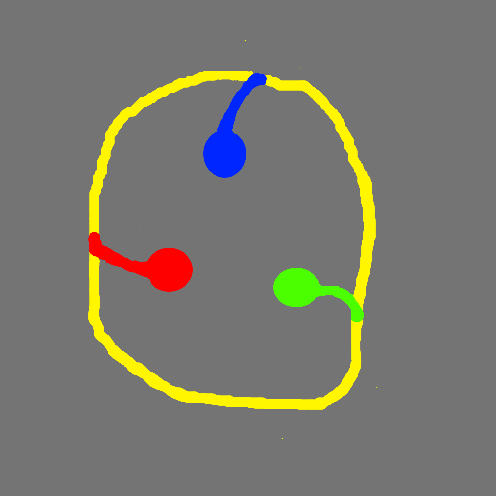

# Path-following-bot

ROS package for a path following bot. Contains a map with different colored paths. The package contains 3 different scripts which each contain a code to move the bot along the common yellow path and divert to a specific color path and stop at the end.

The scripts initialize nodes that subscribe raw_image data, processes it to spit out a direction to move towards, and then publishes velocity output to cmd_vel topic to move the bot in the calculated direction

{height=50% width=50%}

**Scripts/**

        - follower_blue.py: Follows the common path and diverts into the blue path.
        - follower_green.py: Follows the common path and diverts into the green path.
        - follower_red.py: Follows the common path and diverts into the red path.
